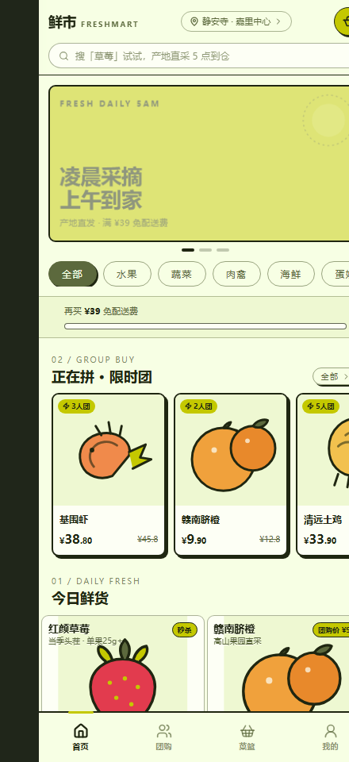
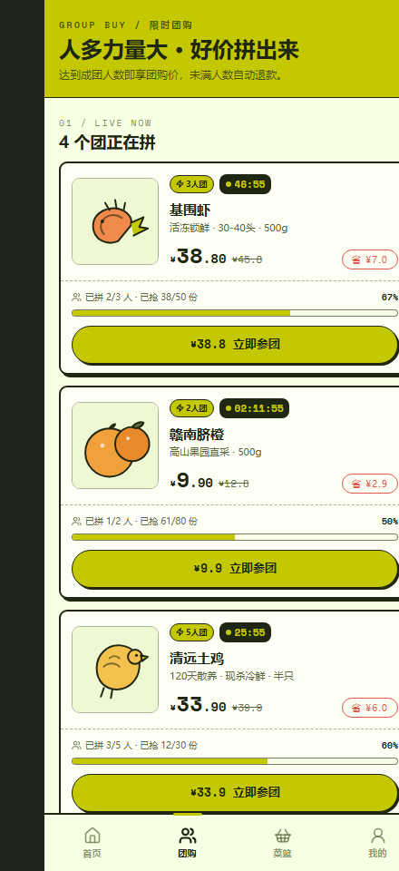
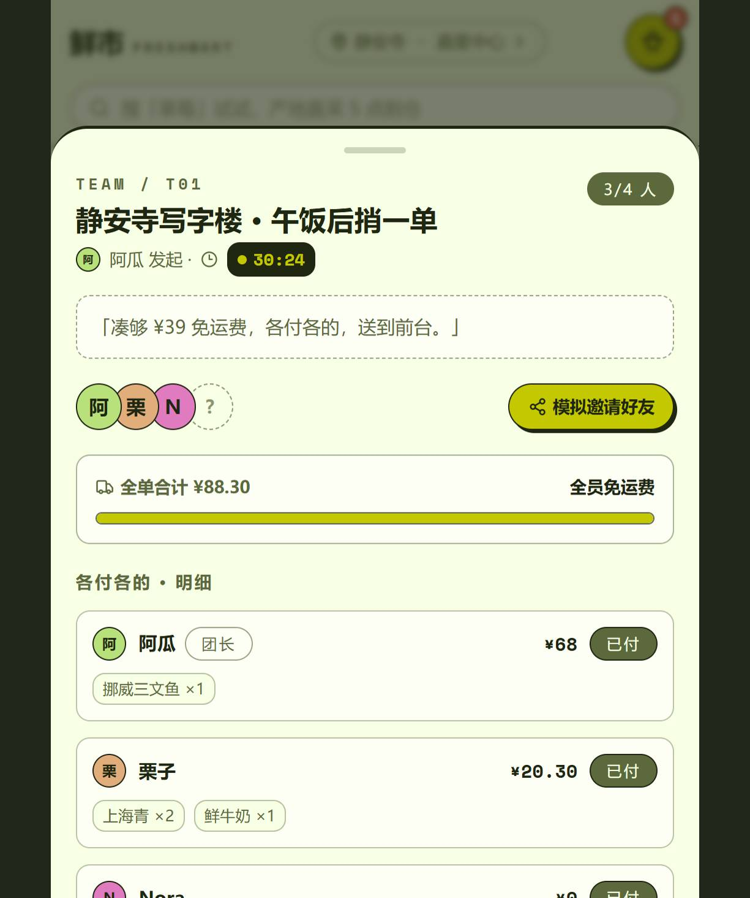
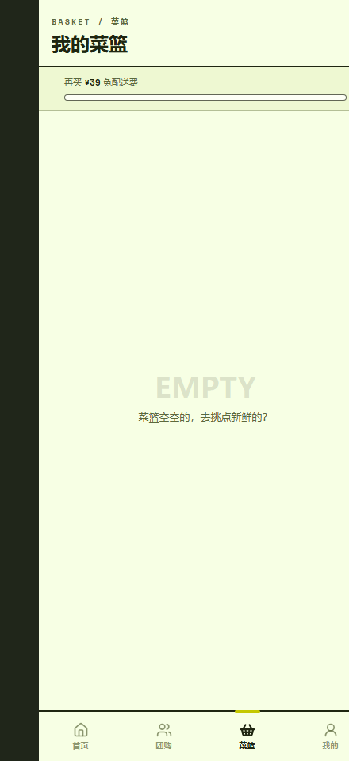

# 鲜市 FreshMart · 生鲜团购拼单小程序

移动端优先的生鲜下单应用：**日常加购 + 限时团购（N 人成团）+ 邻里拼单（各付各的凑免运费）** 三合一。
桌面端访问时自动呈现手机外壳，移动端为全屏小程序式交互。

## 界面预览

| 首页 | 团购 |
| --- | --- |
|  |  |

| 拼单详情 | 菜篮 |
| --- | --- |
|  |  |

## 功能

- **今日鲜货**：分类胶囊筛选、密排商品网格、步进器加购、免运费进度条（满 ¥39 免配送费）
- **限时团购**：实时倒计时、成团人数进度（如 3 人团 已拼 2/3）、团购直减价，一键参团生成「待成团」订单
- **邻里拼单**：发起拼单（标题 / 人数 / 留言 / 携带菜篮）；拼单详情含成员头像栈与空位虚线占位、「模拟邀请好友」演示好友进团、全单免运费进度、**各付各的**分人明细（团长标签 / 已付待付）；可加入附近拼单、带菜篮进团、退出解散
- **菜篮与结算**：数量步进、一键转拼单、配送时段选择、费用明细（商品 + 配送费）
- **我的**：订单列表（普通 / 团购 / 拼单）、我的拼单、优惠券入口
- 深链直达：`/#group`、`/#cart`、`/#mine`

## 技术栈

React 18 · TypeScript · Vite 7 · Tailwind CSS 3 · shadcn/ui 组件库 · sonner Toast
全局状态：React Context + useReducer 风格的分模块 action（购物车 / 团购 / 拼单 / 订单）
商品插画：16 款纯 SVG 手绘，零外链图片依赖

## 本地运行

```bash
npm install
npm run dev        # http://localhost:3000
npm run build      # 产物在 dist/，纯静态站点
```

## 部署（GitHub Pages）

仓库已包含 `.github/workflows/deploy.yml`：push 到 `main` 后自动构建并发布到 Pages。
在仓库 Settings → Pages 中将 Source 选为 **GitHub Actions** 即可，无任何额外密钥配置。

##  road to 微信小程序

本应用为 H5/React 技术栈演示，逻辑层（购物车 / 团购 / 拼单状态机）与 UI 分层清晰，
迁移路径：用 Taro 或 uni-app 包裹组件层，将 `src/store.tsx` 状态层平移至小程序全局状态（Pinia/Zustand/全局 App 数据），
服务端需补齐：商品 / 库存接口、微信支付（JSAPI）、成团回调与退款、订阅消息（拼单进度通知）。

## 目录结构

```
src/
  components/   # TabBar、ProduceArt（SVG 插画）、bits（胶囊/步进器/倒计时/免运费条/弹层骨架）
  pages/        # Home / GroupBuy / Cart / Mine 四个主页面
  sheets/       # 底部弹层：商品详情、发起拼单、拼单详情、结算、团购确认
  store.tsx     # 全局 Context（购物车/团购/拼单/订单/导航/弹层）
  data.ts       # 16 个商品、4 个团、3 个种子拼单
  types.ts      # 领域模型
```
